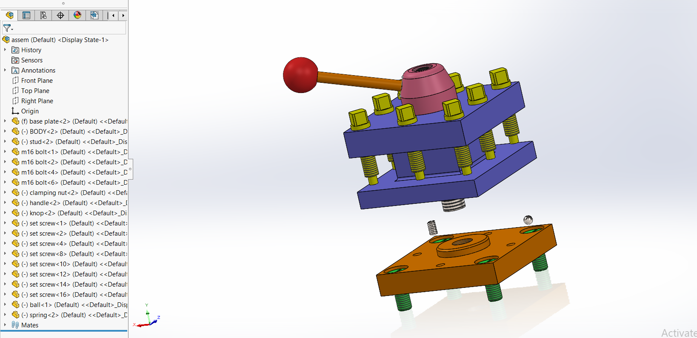
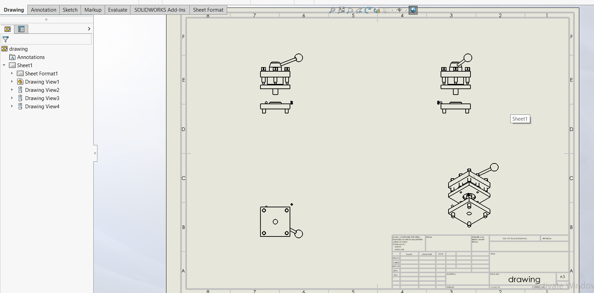

# Mechanical Clamping Fixture

A 3D mechanical CAD project featuring the design, assembly, and engineering documentation of a multi-component mechanical clamping fixture developed using **SOLIDWORKS**.

The project combines a base structure, body, handle-operated mechanism, studs, bolts, set screws, spring, ball, and other fastening components into a complete mechanical assembly.

---

## Project Overview

This project focuses on the 3D modeling, assembly, and engineering documentation of a mechanical clamping fixture using SOLIDWORKS.

Individual components were modeled as separate parts and integrated into the final assembly using mechanical mates and standard fastening elements.

In addition to the 3D assembly, the project includes a SOLIDWORKS engineering drawing containing multiple orthographic and isometric views of the completed design.

---

## Main Components

- Base plate
- Main body
- Clamping nut
- Handle
- Knob
- Stud
- M16 bolts
- Set screws
- Spring
- Ball
- Standard fastening components
- Complete fixture assembly

---

## CAD Model & Assembly

### Complete Fixture Assembly



The complete SOLIDWORKS assembly integrates the structural plates, main body, handle, clamping components, studs, bolts, set screws, spring, ball, and supporting hardware into a multi-component mechanical fixture.

The assembly demonstrates the integration and positioning of individually modeled mechanical parts within a complete CAD system.

---

## Engineering Drawing



A dedicated SOLIDWORKS engineering drawing was created to document the completed assembly.

The drawing contains multiple orthographic views together with an isometric representation, providing a clear engineering representation of the fixture from different orientations.

---

## Mechanical Design Features

The project demonstrates several mechanical CAD concepts:

- Multi-component mechanical assembly
- Handle-operated mechanism
- Spring and ball integration
- Stud and bolt fastening
- Set screw integration
- Structural plate design
- Assembly mating and component positioning
- Standard mechanical hardware integration
- Engineering drawing documentation

---

## CAD Workflow

The project was developed using a component-based mechanical CAD workflow:

1. Individual fixture components were modeled as separate SOLIDWORKS parts.
2. The base plate and main structural components were created.
3. The handle, clamping components, spring, ball, studs, and fasteners were integrated.
4. Assembly mates were used to position and constrain the components.
5. The complete mechanical fixture was assembled and reviewed.
6. A dedicated engineering drawing was created from the completed assembly.
7. Multiple drawing views were used to document the final mechanical design.

---

## Project Structure

```text
mechanical-clamping-fixture-solidworks/
│
├── assets/
│   ├── clamping_fixture_assembly.png
│   └── clamping_fixture_engineering_drawing.png
│
├── solidworks-files/
│   ├── SOLIDWORKS part files (.SLDPRT)
│   ├── assem.SLDASM
│   └── drawing.SLDDRW
│
└── README.md
```

---

## SOLIDWORKS Files

The repository includes the original editable SOLIDWORKS project files.

The `solidworks-files/` directory contains the individual part models, complete assembly, and engineering drawing used throughout the project.

### File Types

- `.SLDPRT` — SOLIDWORKS Part files
- `.SLDASM` — SOLIDWORKS Assembly file
- `.SLDDRW` — SOLIDWORKS Drawing file

The source files can be opened in SOLIDWORKS for inspection, modification, assembly review, or further development.

---

## Skills Demonstrated

- 3D CAD modeling
- SOLIDWORKS part modeling
- Mechanical fixture design
- Multi-component assembly
- Assembly mates
- Mechanical fastening
- Spring and hardware integration
- Engineering drawing creation
- Orthographic drawing views
- Isometric drawing views
- Mechanical CAD documentation

---

## Tools

- **SOLIDWORKS**
- 3D Part Modeling
- Assembly Design
- Engineering Drawing
- Mechanical CAD

---

## Project Scope

This project demonstrates a complete mechanical CAD workflow covering individual part modeling, multi-component assembly, and engineering drawing documentation.

The combination of editable component files, the final assembly, and a dedicated engineering drawing provides a complete representation of the mechanical CAD design process.
